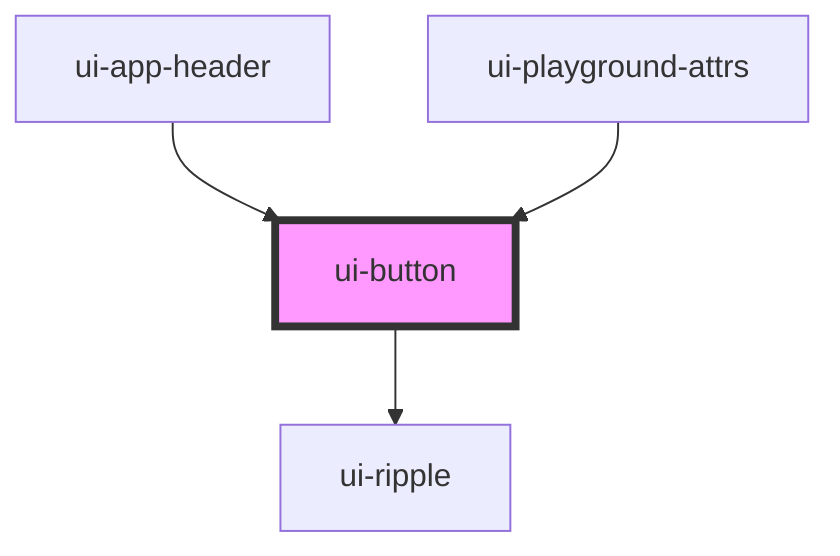

# ui-button

<!-- Auto Generated Below -->

## Properties

| Property     | Attribute    | Description | Type                                                                                                                                                                                                                                                                                                                                                                                                                                                                                                                                                                                                                                                                                                                                                                                                                                                                                                                                                                                                                                                                                                                                                                                                                                                                                                                                                                                                                                                                                                                                                                                                                                                                                                                                                                                                                                                       | Default     |
| ------------ | ------------ | ----------- | ---------------------------------------------------------------------------------------------------------------------------------------------------------------------------------------------------------------------------------------------------------------------------------------------------------------------------------------------------------------------------------------------------------------------------------------------------------------------------------------------------------------------------------------------------------------------------------------------------------------------------------------------------------------------------------------------------------------------------------------------------------------------------------------------------------------------------------------------------------------------------------------------------------------------------------------------------------------------------------------------------------------------------------------------------------------------------------------------------------------------------------------------------------------------------------------------------------------------------------------------------------------------------------------------------------------------------------------------------------------------------------------------------------------------------------------------------------------------------------------------------------------------------------------------------------------------------------------------------------------------------------------------------------------------------------------------------------------------------------------------------------------------------------------------------------------------------------------------------------- | ----------- |
| `background` | `background` |             | `"base" \| "primary-light" \| "primary-dark" \| "secondary-light" \| "secondary-dark" \| "success" \| "danger" \| "warning" \| "info" \| "grey-100" \| "grey-90" \| "grey-80" \| "grey-70" \| "grey-60" \| "grey-50" \| "grey-40" \| "grey-30" \| "grey-20" \| "grey-10" \| "red-100" \| "red-90" \| "red-80" \| "red-70" \| "red-60" \| "red-50" \| "red-40" \| "red-30" \| "red-20" \| "red-10" \| "pink-100" \| "pink-90" \| "pink-80" \| "pink-70" \| "pink-60" \| "pink-50" \| "pink-40" \| "pink-30" \| "pink-20" \| "pink-10" \| "purple-100" \| "purple-90" \| "purple-80" \| "purple-70" \| "purple-60" \| "purple-50" \| "purple-40" \| "purple-30" \| "purple-20" \| "purple-10" \| "indigo-100" \| "indigo-90" \| "indigo-80" \| "indigo-70" \| "indigo-60" \| "indigo-50" \| "indigo-40" \| "indigo-30" \| "indigo-20" \| "indigo-10" \| "navy-100" \| "navy-90" \| "navy-80" \| "navy-70" \| "navy-60" \| "navy-50" \| "navy-40" \| "navy-30" \| "navy-20" \| "navy-10" \| "blue-100" \| "blue-90" \| "blue-80" \| "blue-70" \| "blue-60" \| "blue-50" \| "blue-40" \| "blue-30" \| "blue-20" \| "blue-10" \| "teal-100" \| "teal-90" \| "teal-80" \| "teal-70" \| "teal-60" \| "teal-50" \| "teal-40" \| "teal-30" \| "teal-20" \| "teal-10" \| "mint-100" \| "mint-90" \| "mint-80" \| "mint-70" \| "mint-60" \| "mint-50" \| "mint-40" \| "mint-30" \| "mint-20" \| "mint-10" \| "green-100" \| "green-90" \| "green-80" \| "green-70" \| "green-60" \| "green-50" \| "green-40" \| "green-30" \| "green-20" \| "green-10" \| "yellow-100" \| "yellow-90" \| "yellow-80" \| "yellow-70" \| "yellow-60" \| "yellow-50" \| "yellow-40" \| "yellow-30" \| "yellow-20" \| "yellow-10" \| "orange-100" \| "orange-90" \| "orange-80" \| "orange-70" \| "orange-60" \| "orange-50" \| "orange-40" \| "orange-30" \| "orange-20" \| "orange-10"` | `undefined` |
| `color`      | `color`      |             | `"base" \| "primary-light" \| "primary-dark" \| "secondary-light" \| "secondary-dark" \| "success" \| "danger" \| "warning" \| "info" \| "grey-100" \| "grey-90" \| "grey-80" \| "grey-70" \| "grey-60" \| "grey-50" \| "grey-40" \| "grey-30" \| "grey-20" \| "grey-10" \| "red-100" \| "red-90" \| "red-80" \| "red-70" \| "red-60" \| "red-50" \| "red-40" \| "red-30" \| "red-20" \| "red-10" \| "pink-100" \| "pink-90" \| "pink-80" \| "pink-70" \| "pink-60" \| "pink-50" \| "pink-40" \| "pink-30" \| "pink-20" \| "pink-10" \| "purple-100" \| "purple-90" \| "purple-80" \| "purple-70" \| "purple-60" \| "purple-50" \| "purple-40" \| "purple-30" \| "purple-20" \| "purple-10" \| "indigo-100" \| "indigo-90" \| "indigo-80" \| "indigo-70" \| "indigo-60" \| "indigo-50" \| "indigo-40" \| "indigo-30" \| "indigo-20" \| "indigo-10" \| "navy-100" \| "navy-90" \| "navy-80" \| "navy-70" \| "navy-60" \| "navy-50" \| "navy-40" \| "navy-30" \| "navy-20" \| "navy-10" \| "blue-100" \| "blue-90" \| "blue-80" \| "blue-70" \| "blue-60" \| "blue-50" \| "blue-40" \| "blue-30" \| "blue-20" \| "blue-10" \| "teal-100" \| "teal-90" \| "teal-80" \| "teal-70" \| "teal-60" \| "teal-50" \| "teal-40" \| "teal-30" \| "teal-20" \| "teal-10" \| "mint-100" \| "mint-90" \| "mint-80" \| "mint-70" \| "mint-60" \| "mint-50" \| "mint-40" \| "mint-30" \| "mint-20" \| "mint-10" \| "green-100" \| "green-90" \| "green-80" \| "green-70" \| "green-60" \| "green-50" \| "green-40" \| "green-30" \| "green-20" \| "green-10" \| "yellow-100" \| "yellow-90" \| "yellow-80" \| "yellow-70" \| "yellow-60" \| "yellow-50" \| "yellow-40" \| "yellow-30" \| "yellow-20" \| "yellow-10" \| "orange-100" \| "orange-90" \| "orange-80" \| "orange-70" \| "orange-60" \| "orange-50" \| "orange-40" \| "orange-30" \| "orange-20" \| "orange-10"` | `undefined` |
| `disabled`   | `disabled`   |             | `boolean`                                                                                                                                                                                                                                                                                                                                                                                                                                                                                                                                                                                                                                                                                                                                                                                                                                                                                                                                                                                                                                                                                                                                                                                                                                                                                                                                                                                                                                                                                                                                                                                                                                                                                                                                                                                                                                                  | `false`     |
| `round`      | `round`      |             | `"base" \| "fab" \| "none" \| "pill"`                                                                                                                                                                                                                                                                                                                                                                                                                                                                                                                                                                                                                                                                                                                                                                                                                                                                                                                                                                                                                                                                                                                                                                                                                                                                                                                                                                                                                                                                                                                                                                                                                                                                                                                                                                                                                      | `"base"`    |
| `size`       | `size`       |             | `"large" \| "larger" \| "medium" \| "small" \| "smaller" \| "x-large" \| "x-small" \| "xx-large" \| "xx-small"`                                                                                                                                                                                                                                                                                                                                                                                                                                                                                                                                                                                                                                                                                                                                                                                                                                                                                                                                                                                                                                                                                                                                                                                                                                                                                                                                                                                                                                                                                                                                                                                                                                                                                                                                            | `undefined` |
| `type`       | `type`       |             | `"base" \| "flat" \| "link" \| "outline"`                                                                                                                                                                                                                                                                                                                                                                                                                                                                                                                                                                                                                                                                                                                                                                                                                                                                                                                                                                                                                                                                                                                                                                                                                                                                                                                                                                                                                                                                                                                                                                                                                                                                                                                                                                                                                  | `"outline"` |

## Events

| Event     | Description | Type               |
| --------- | ----------- | ------------------ |
| `uiClick` |             | `CustomEvent<any>` |

## Dependencies

### Used by

 - [ui-app-header](../ui-app-header)
 - [ui-playground-attrs](../ui-playground/ui-playground-attrs)

### Depends on

- [ui-ripple](../ui-ripple)

### Graph

----------------------------------------------

*Built with [StencilJS](https://stenciljs.com/)*
