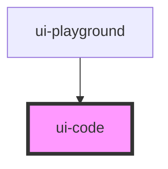

# ui-code

<!-- Auto Generated Below -->

## Properties

| Property   | Attribute  | Description | Type                                                       | Default |
| ---------- | ---------- | ----------- | ---------------------------------------------------------- | ------- |
| `language` | `language` |             | `"java" \| "javascript" \| "sql" \| "typescript" \| "xml"` | `"xml"` |

## Methods

### `setCode(code: any) => Promise<void>`

#### Returns

Type: `Promise<void>`

## Dependencies

### Used by

 - [ui-playground](../ui-playground)

### Graph

----------------------------------------------

*Built with [StencilJS](https://stenciljs.com/)*
