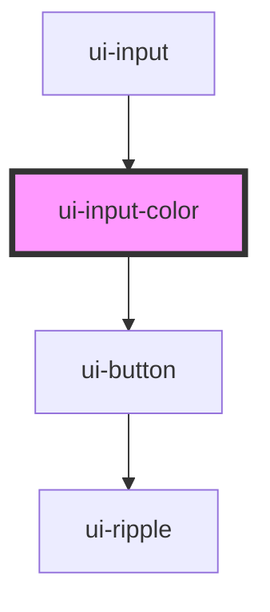

# ui-input-color

<!-- Auto Generated Below -->

## Events

| Event          | Description | Type               |
| -------------- | ----------- | ------------------ |
| `uiInputEvent` |             | `CustomEvent<any>` |

## Dependencies

### Used by

 - [ui-input](..)

### Depends on

- [ui-button](../../ui-button)

### Graph

----------------------------------------------

*Built with [StencilJS](https://stenciljs.com/)*
