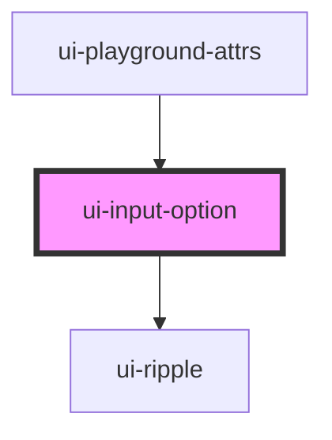

# ui-input-option

<!-- Auto Generated Below -->

## Properties

| Property   | Attribute  | Description | Type      | Default     |
| ---------- | ---------- | ----------- | --------- | ----------- |
| `selected` | `selected` |             | `boolean` | `false`     |
| `value`    | `value`    |             | `string`  | `undefined` |

## Events

| Event                | Description | Type               |
| -------------------- | ----------- | ------------------ |
| `uiInputOptionEvent` |             | `CustomEvent<any>` |

## Methods

### `getValue() => Promise<string>`

#### Returns

Type: `Promise<string>`

## Dependencies

### Used by

 - [ui-playground-attrs](../../ui-playground/ui-playground-attrs)

### Depends on

- [ui-ripple](../../ui-ripple)

### Graph

----------------------------------------------

*Built with [StencilJS](https://stenciljs.com/)*
