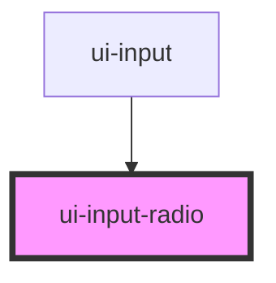

# ui-input-radio

<!-- Auto Generated Below -->

## Properties

| Property      | Attribute     | Description | Type                         | Default     |
| ------------- | ------------- | ----------- | ---------------------------- | ----------- |
| `orientation` | `orientation` |             | `"horizontal" \| "vertical"` | `undefined` |

## Dependencies

### Used by

 - [ui-input](..)

### Graph

----------------------------------------------

*Built with [StencilJS](https://stenciljs.com/)*
