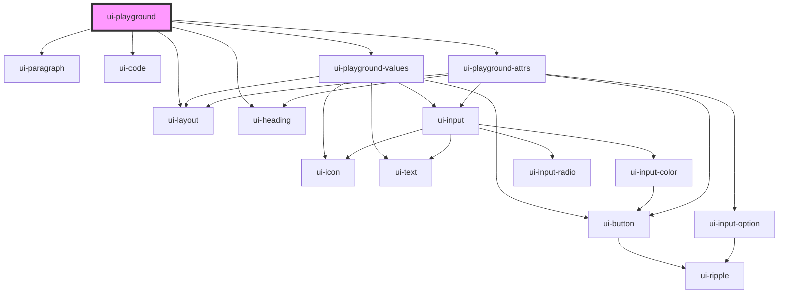

# ui-playground

<!-- Auto Generated Below -->

## Properties

| Property | Attribute | Description | Type     | Default     |
| -------- | --------- | ----------- | -------- | ----------- |
| `tag`    | `tag`     |             | `string` | `undefined` |

## Dependencies

### Depends on

- [ui-layout](../ui-layout)
- [ui-heading](../ui-heading)
- [ui-paragraph](../ui-paragraph)
- [ui-code](../ui-code)
- [ui-playground-values](ui-playground-values)
- [ui-playground-attrs](ui-playground-attrs)

### Graph

----------------------------------------------

*Built with [StencilJS](https://stenciljs.com/)*
