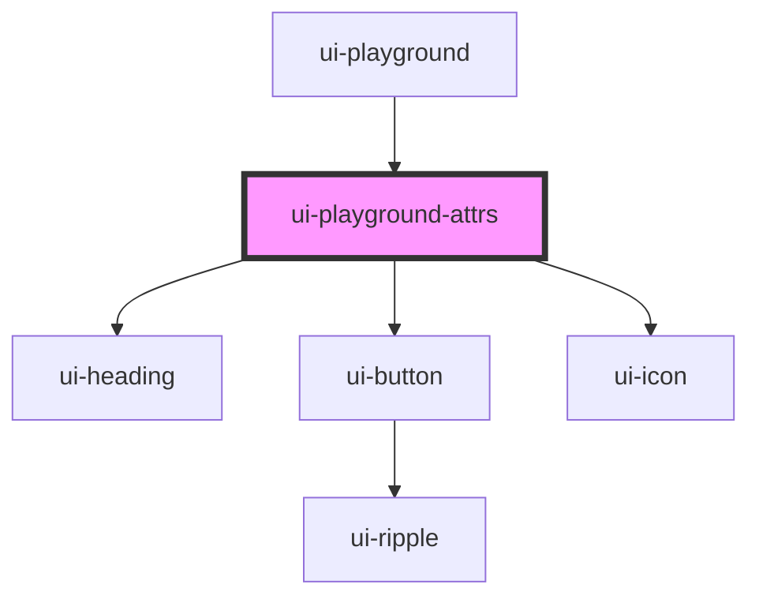

# ui-playground-attrs

<!-- Auto Generated Below -->

## Properties

| Property  | Attribute | Description | Type                | Default     |
| --------- | --------- | ----------- | ------------------- | ----------- |
| `doc`     | --        |             | `JsonDocsComponent` | `undefined` |
| `element` | --        |             | `HTMLElement`       | `undefined` |

## Dependencies

### Used by

 - [ui-playground](..)

### Depends on

- [ui-heading](../../ui-heading)
- [ui-button](../../ui-button)
- [ui-icon](../../ui-icon)

### Graph

----------------------------------------------

*Built with [StencilJS](https://stenciljs.com/)*
