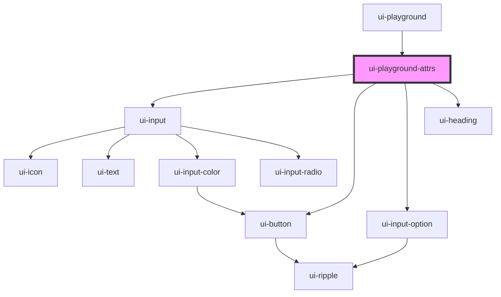

# ui-playground-attrs

<!-- Auto Generated Below -->

## Properties

| Property   | Attribute | Description | Type                  | Default |
| ---------- | --------- | ----------- | --------------------- | ------- |
| `docs`     | --        |             | `JsonDocsComponent[]` | `[]`    |
| `elements` | --        |             | `HTMLElement[]`       | `[]`    |

## Events

| Event                  | Description | Type               |
| ---------------------- | ----------- | ------------------ |
| `updatePlaygroundCode` |             | `CustomEvent<any>` |

## Dependencies

### Used by

 - [ui-playground](..)

### Depends on

- [ui-input](../../ui-input)
- [ui-button](../../ui-button)
- [ui-input-option](../../ui-input/ui-input-option)
- [ui-heading](../../ui-heading)

### Graph

----------------------------------------------

*Built with [StencilJS](https://stenciljs.com/)*
