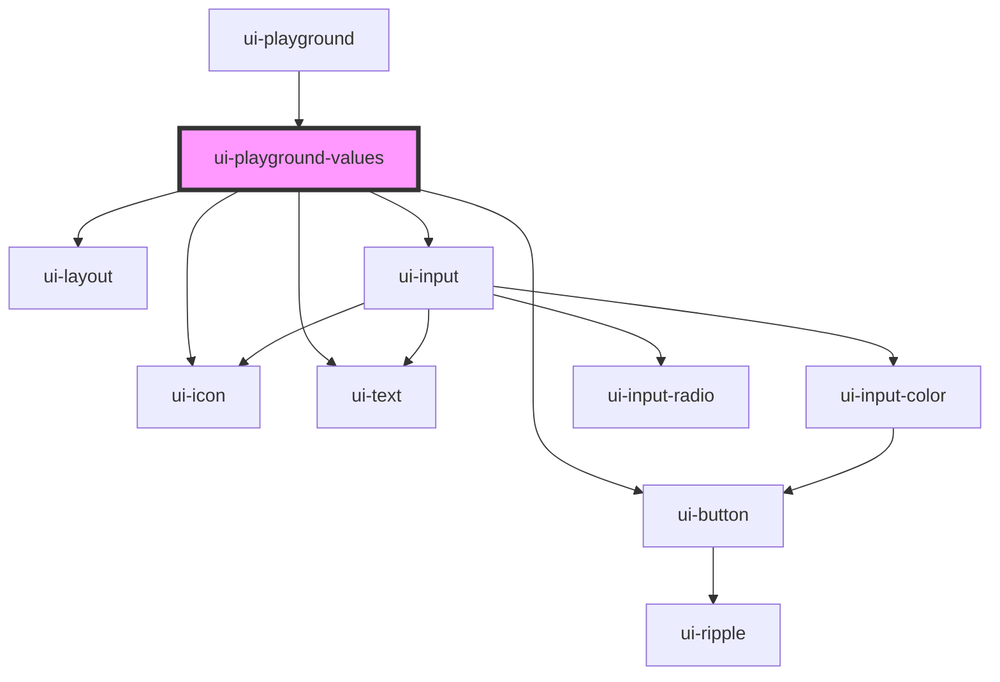

# ui-playground-values

<!-- Auto Generated Below -->

## Properties

| Property | Attribute | Description | Type           | Default     |
| -------- | --------- | ----------- | -------------- | ----------- |
| `prop`   | --        |             | `JsonDocsProp` | `undefined` |

## Dependencies

### Used by

 - [ui-playground](..)

### Depends on

- [ui-layout](../../ui-layout)
- [ui-input](../../ui-input)
- [ui-icon](../../ui-icon)
- [ui-button](../../ui-button)
- [ui-text](../../ui-text)

### Graph

----------------------------------------------

*Built with [StencilJS](https://stenciljs.com/)*
