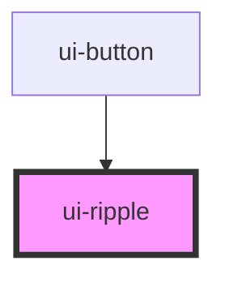

# ui-ripple

<!-- Auto Generated Below -->

## Methods

### `toggle(e: CustomEvent<any>) => Promise<void>`

#### Returns

Type: `Promise<void>`

## Dependencies

### Used by

 - [ui-button](../ui-button)

### Graph

----------------------------------------------

*Built with [StencilJS](https://stenciljs.com/)*
